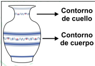

```{r data generation, echo = FALSE, results = "hide"}
## Solo PDF
##options(tinytex.verbose = TRUE) ##! Package pdftex.def Error: File `lavasija.png' not found: using draft setting.
options(scipen=999)
typ <- match_exams_device()
##opts_chunk$set(fig.cap="")
library(exams)
# library(xtable)
# require(stats)
# library(knitr)

a1<-sample(seq(from = 100, to = 250, by = 2), 10)
casilla1<-min(a1)
casilla2<-max(a1)
increm<-casilla2-casilla1
a2<-sample(seq(from = casilla2, to = casilla2+increm, by = 2))
casilla3<-min(a2)
casilla4<-max(a2)
a3<-sample(seq(from = casilla4, to = casilla4+increm, by = 2))
casilla5<-min(a3)
casilla6<-max(a3)
crpizq<-casilla6*1.5
c1<-sample(seq(from = crpizq, to = crpizq+increm, by = 2))
casilla7<-min(c1)
casilla8<-max(c1)
c2<-sample(seq(from = casilla8, to = casilla8+increm, by = 2))  
casilla9<-min(c2)
casilla10<-max(c2)
c3<-sample(seq(from = casilla10, to = casilla10+increm, by = 2))
casilla11<-min(c3)
casilla12<-max(c3)

precio1<-round(sample(seq(from=20000, to=40000, by=500), 1),1)
##precio1p<-paste("$",precio1,collapse="")
precio1p<-paste(precio1,collapse="")
precio1p
precio2<-precio1+15000
##precio2p<-paste("$",precio2,collapse="")
precio2p<-paste(precio2,collapse="")
precio2p
precio3<-precio2+15000
##precio3p<-paste("$",precio3,collapse="")
precio3p<-paste(precio3,collapse="")
precio3p

preciopregunta<-round(sample(c(precio1,precio2,precio3), 1),digits=0)
preciopregunta

cuellop1<-sample(seq(from = casilla1,to = casilla2-1, by = 2), 1)
cuerpop1<-sample(seq(from = casilla7,to = casilla8-1, by = 2), 1)
cuellop2<-sample(seq(from = casilla3,to = casilla4-1, by = 2), 1)
cuellop2
cuerpop2<-sample(seq(from = casilla9,to = casilla10-1, by = 2), 1)
cuerpop2
cuellop3<-sample(seq(from = casilla5,to = casilla6-1, by = 2), 1)
cuerpop3<-sample(seq(from = casilla11,to = casilla12-1, by = 2), 1)

interv1<-paste(c("[",casilla1,", ",casilla2,")"), collapse = "")
interv2<-paste(c("[",casilla3,", ",casilla4,")"), collapse = "")
interv3<-paste(c("[",casilla5,", ",casilla6,")"), collapse = "")

interv4<-paste(c("[",casilla7,", ",casilla8,")"), collapse = "")
interv5<-paste(c("[",casilla9,", ",casilla10,")"), collapse = "")
interv6<-paste(c("[",casilla11,", ",casilla12,")"), collapse = "")

colcuello<-c(interv1,interv2,interv3)
colcuerpo<-c(interv4,interv5,interv6)
prexio<-c(precio1p,precio2p,precio3p)

dataf<-data.frame(colcuello,colcuerpo,prexio)
colnames(dataf)<-c("Contorno de cuello (en mm)","Contorno de cuerpo (en mm)","Precio")

if(preciopregunta==precio1){
questions<-solutions<-explanations<-NULL
questions[1]<-paste("Vasija de " ,cuellop1, " mm en contorno de cuello y ", 
                    cuerpop1, " mm en contorno de cuerpo.")
solutions[1]<-TRUE
explanations[1]<-"."

questions[2]<-paste("Vasija de " ,cuellop1, " mm en contorno de cuello y ", 
                    cuerpop2, " mm en contorno de cuerpo.")
solutions[2]<-FALSE
explanations[2]<-"."

questions[3]<-paste("Vasija de " ,cuellop2, " mm en contorno de cuello y ", 
                    cuerpop3, " mm en contorno de cuerpo.")
solutions[3]<-FALSE
explanations[3]<-"."

questions[4]<-paste("Vasija de " ,casilla1, " mm en contorno de cuello y ", 
                    casilla8, " mm en contorno de cuerpo.")
solutions[4]<-FALSE
explanations[4]<-"."

orden<-sample(1:4)
questions<-questions[orden]
solutions<-solutions[orden]
explanations<-explanations[orden]

}else if (preciopregunta==precio2){
questions<-solutions<-explanations<-NULL
questions[1]<-paste("Vasija de " ,cuellop2, " mm en contorno de cuello y ", 
                    cuerpop2, " mm en contorno de cuerpo.")
solutions[1]<-TRUE
explanations[1]<-"."
questions[2]<-paste("Vasija de " ,cuellop1, " mm en contorno de cuello y ", 
                    cuerpop2, " mm en contorno de cuerpo.")
solutions[2]<-FALSE
explanations[2]<-"."
questions[3]<-paste("Vasija de " ,cuellop2, " mm en contorno de cuello y ", 
                    cuerpop3, " mm en contorno de cuerpo.")
solutions[3]<-FALSE
explanations[3]<-"."
questions[4]<-paste("Vasija de " ,casilla3, " mm en contorno de cuello y ", 
                    casilla10, " mm en contorno de cuerpo.")
solutions[4]<-FALSE
explanations[4]<-"."

orden<-sample(1:4)
questions<-questions[orden]
solutions<-solutions[orden]
explanations<-explanations[orden]
} else {questions<-solutions<-explanations<-NULL
  questions[1]<-paste("Vasija de " ,cuellop3, " mm en contorno de cuello y ", 
                    cuerpop3, " mm en contorno de cuerpo.")
  solutions[1]<-TRUE
  explanations[1]<-"."
  questions[2]<-paste("Vasija de " ,cuellop1, " mm en contorno de cuello y ", 
                    cuerpop2, " mm en contorno de cuerpo.")
  solutions[2]<-FALSE
  explanations[2]<-"."
  questions[3]<-paste("Vasija de " ,cuellop2, " mm en contorno de cuello y ", 
                    cuerpop3, " mm en contorno de cuerpo.")
  solutions[3]<-FALSE
  explanations[3]<-"."
  questions[4]<-paste("Vasija de " ,casilla5, " mm en contorno de cuello y ", 
                    casilla12, " mm en contorno de cuerpo.")
  solutions[4]<-FALSE
  explanations[4]<-"."
  orden<-sample(1:4)
  questions<-questions[orden]
  solutions<-solutions[orden]
  explanations<-explanations[orden]}

image98 <- '
 \\begin{tikzpicture}
  \\node{
    \\begin{tabular}{|c|c|c|}
      \\hline
      Contorno de cuello  & Contorno de cuerpo  &  Precio\\\\
          (en mm)         &      (en mm)        & (en pesos)\\\\ \\hline
            {%s}          &        {%s}         &    {%s}\\\\ \\hline
            {%s}          &        {%s}         &    {%s}\\\\ \\hline
            {%s}          &        {%s}         &    {%s}\\\\ \\hline
    \\end{tabular}
  };
\\end{tikzpicture}
'
image98 <-sprintf(image98,interv1,interv4,precio1p,interv2,interv5,precio2p,interv3,interv6,precio3p)
```

Question
========

```{r, include=FALSE}
download.file("https://i.postimg.cc/KcdrtQkw/lavasija.png", "lavasija.png")
```

\
{width=4cm}

La tabla muestra la relación entre precios y medidas que maneja un artesano en la venta de vasijas:

\
```{r image98, warning=FALSE,echo = FALSE, results = "asis"}
knitr::opts_chunk$set(warning = FALSE, message = FALSE) 
include_tikz(image98, name = "grafikko98_01", markup = "markdown",format = typ, library = c("3d", "babel"), packages=c("tikz","xcolor"),width = "8.5cm")
```

¿Cuál de las siguientes vasijas tiene un precio de $`r preciopregunta`?

```{r questionlist, echo = FALSE, results = "asis"}
library(exams)
answerlist(questions, markup = "markdown")
```

Solution
========
```{r solutionlist, echo = FALSE, results = "asis"}
library(exams)
answerlist(ifelse(solutions, "Verdadero", "Falso"), markup = "markdown")
```

Meta-information
================
exname: vasijas(single-choice)
extype: schoice
exsolution: `r mchoice2string(solutions)`